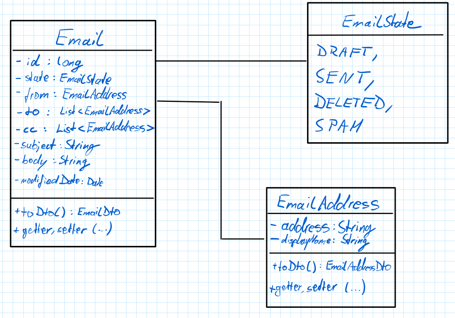

# Design Process

This document describes the step of designing the service and outlines decisions being made, e.g. concerning the
architecture.

## Tech-Stack / Libraries

For tech-stack `Java 17` with `Maven` build tool is chosen as I am familiar with those. To help implementing a REST
API service - and as suggested in the task - `Spring Boot` is the main library being used (_starter_, _starter-web_ and
_starter-test_ libraries; _maven-plugin_ to build the application). The database of the application is
a `PostgreSQL` instance. Emails follow a standardised format; therefore all email objects will have the same amount of
information using the same representation. Changes are unlikely. Having such a fixed schema, a relative database is a
good choice. As I worked with `PostgreSQL` lately, I stick to it. The database integration requires the _data-jpa_
library of Spring Boot as well as the _postgresql_ driver library. Using the _docker-compose_ library of Spring, a
docker Postgres container can be started automatically on application start using the [compose.yml](compose.yml) file.
For running an integration test covering the whole application, the database has to run as well. Production database
should not be used for testing, that is why `Testcontainers` library is used to host a PostgreSQL temporary docker
container for the integration test only.

See project's [pom.xml](pom.xml).

## Architecture

The service's architecture is oriented towards the `Model View Controller Service` (MVCS) pattern. Because there is no
view, it is more of a "Model Controller Service" pattern.

All types needed to represent the data (emails) is represented in the model part, controller handles all (CRUD) requests
to the email service and delegates the tasks associated with the requests to the service(s) that implement the tasks'
logic. An external database is used to store all emails.

The model main type/class is [Email.java](src/main/java/de/jjakobus/emailrestservice/model/Email.java) containing all
relevant information of an email. [EmailState.java](src/main/java/de/jjakobus/emailrestservice/model/EmailState.java) is
an enum with all valid values for the state of an email. To represent an email address which can have an additional
display name (like "Peter Müller <peter.mueller(a)
gmx.de>"), [EmailAddress.java](src/main/java/de/jjakobus/emailrestservice/model/EmailAddress.java) is used to represent
this structure.

The integration/connection to the external database is handled using Spring Boot's JPA implementation. This way database
connection details are specified in the [application.yml](src/main/resources/application.yml). Spring JPA automatically
connects to the specified database on the application's start and supplies repositories (e.g. `CrudRepository`) to
access the data of a database's table. The "data" types are the model's classes described above, which are marked as
entities (`@Entity`) for this purpose.

Additionally, there are DTOs (Data Transfer Objects) types/classes. While
entities are mutable per se, the DTOs enable to pass immutable objects between service and clients. Further more there
is no ID yet when a new email should get inserted, but gets generated by the server at insertion time. For this case
there is [InsertNewEmailDto.java](src/main/java/de/jjakobus/emailrestservice/model/dtos/InsertEmailDto.java).

The controller defines the REST endpoints needed for required CRUD operations. There are these four endpoints:

| # | CRUD   | path           | method | success code  | return type | failure code(s)                    |
|---|--------|----------------|--------|---------------|-------------|------------------------------------|
| 1 | Create | /insert        | POST   | 201 (created) | EmailDto    | /                                  |
| 3 | Read   | /query?id={id} | GET    | 200 (ok)      | EmailDto    | 404 (not found)                    |
| 4 | Update | /update/{id}   | PUT    | 200 (ok)      | /           | 400 (bad request), 404 (not found) |
| 5 | Delete | /delete/{id}   | DELETE | 200 (ok)      | /           | 404 (not found)                    |

Create, Read and Delete do offer bulk operations by specifying request/url parameter "bulk" as additional endpoints.

There are two
services: [EmailStoreService.java](src/main/java/de/jjakobus/emailrestservice/service/EmailStoreService.java) as a
layer between the JPA email repository and the controller which implements all custom logic like conditions when an
email is allowed to be updated. This way controller does not need to have this logic and be focused on handling the REST
requests, only. [EmailSpamService.java](src/main/java/de/jjakobus/emailrestservice/service/EmailSpamService.java) is a
service to schedule the
regular spam classification task. It uses the store service to identify mails to be marked as spam.

## Process

To start of with a simple _Spring Boot_ maven project template has been generated (using IntelliJ).

Approaching this task in test-driven development manner, next step has been the creation of a whole-service-scaled
integration test: [EmailRestServiceAppIT.java](src/test/java/de/jjakobus/emailrestservice/EmailRestServiceAppIT.java).
The test covers all HTTP endpoints specified in the task. Authentic test data is used to validate all "layers" of
application are working as expected when the application is run together with its web server. To cover all scenarios of
request-response or input/output pairs the unit tests to be defined are used.

In the process of creating the test cases, types/classes used in the application and needed for creating example data in
the tests have been created and defined in their features. In the first step "drafts" for those types were created.
After setting up the database connection using Spring JPA, entities and DTOs were created from previous "draft" types (
see model's description above in [Architecture](#architecture)).

Next needed controller endpoints are added as specified by the whole-application integration
test ([EmailRestServiceAppIT.java](src/test/java/de/jjakobus/emailrestservice/EmailRestServiceAppIT.java)). Based on
this endpoints a unit test for the controller is created and test cases covering all request-response pairs possible are
implemented. Services used by the controller are mocked to focus the unit test on the controller only.
